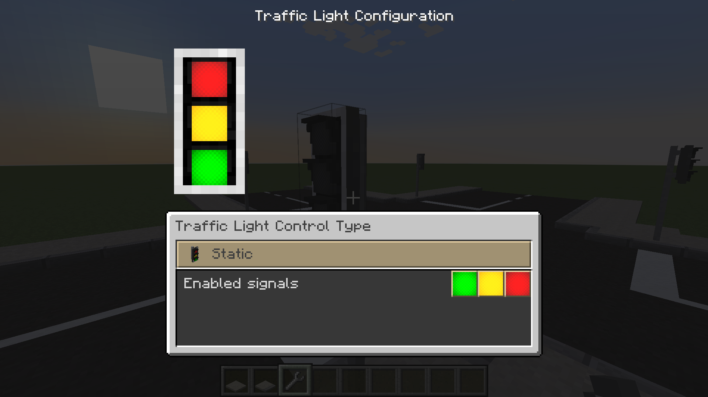
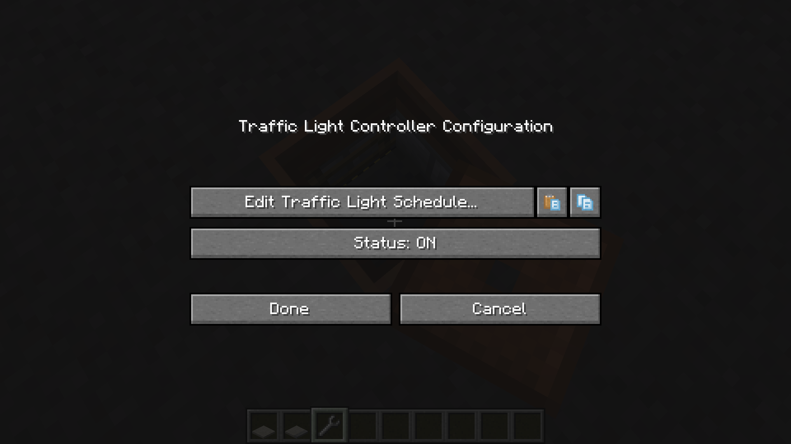
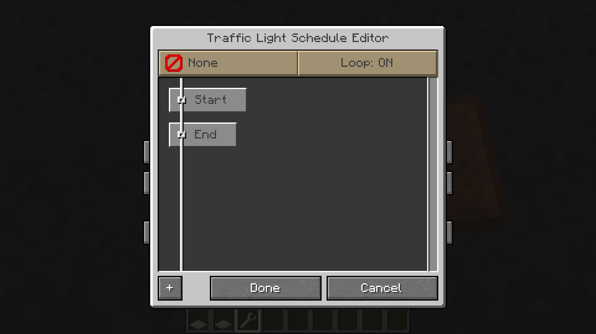
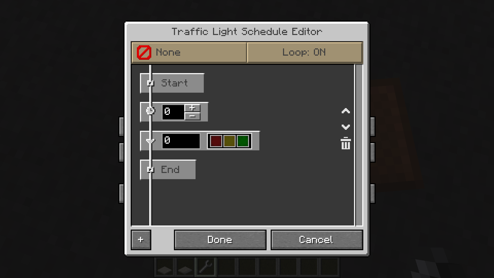
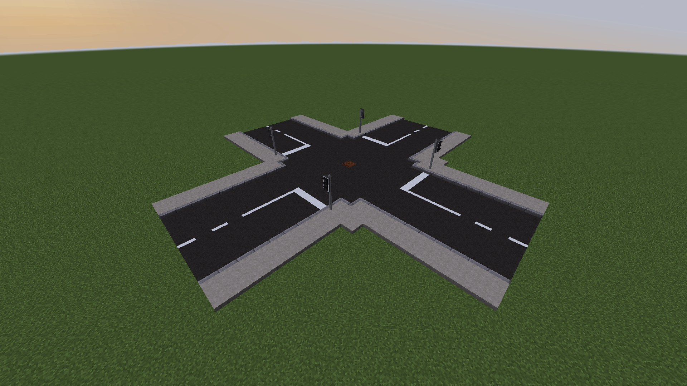
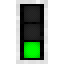
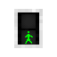
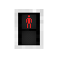
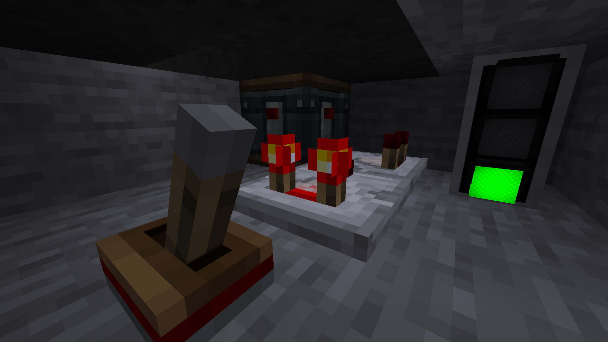

[[Traffic Light|Traffic Lights]] can be used in your road or railway setup to add a bit more life to it.  
They also allow you to configure a schedule that the Traffic Light executes either on a continous loop, or only once.

This blog post will act as a tutorial, explaining how you can configure Traffic Lights to cycle through different states, how to do it with a [[Traffic Light Controller]] and how to add [[Traffic Light Request Button|Traffic Light Request Buttons]] to the mix to make a pedestrian crosswalk.

<!-- more -->

## Notes

This post will contain screenshots depicting TrafficCraft 1.20.1-1.2.0-beta.3 for Fabric.  
The screenshots may no longer be up to date when you read this post. A note will be added where necessary, to inform about any (major) changes.

## Traffic Light and Traffic Light Controller

When setting up Traffic Lights, you have to choose between either configuring the Traffic Light directly, or manage it through a Traffic Light Controller.  
Should the Traffic Light be isolated, meaning it doesn't need to stay in sync with other Traffic Lights, can you easily just configure it directly. The Traffic Light Controller is best used for managing multiple Traffic Lights at the same time, keeping them in sync.

Both components can be interacted with using the [[Wrench]]. The GUI it opens is slightly different for each block.

{ .thumb }
{ .thumb }

On the Traffic Light itself do you have a preview of the Traffic Light itself, allowing you to change its appearance (How many lights it shows, if it should use symbols or just colors, if it should be a Tram signal, etc.), but you can also set its mode to either be Static, use its own Schedule, or use the Traffic Light Controller.

The Traffic Light Controller only has a button to directly edit the Schedule and to turn it on or off.

### Schedule Editor

{ .thumb }

When entering the Traffic Light Schedule Screen by pressing the "Edit Traffic Light Schedule..." button, will you be greeted with a GUI allowing you to configure the Schedule of the Traffic Light or Traffic Light Controller.

On the top-left is a button that can be used to set the action that should trigger this Schedule.  
This option is only useful for schedules that do have looping disabled. Pressing the button toggles the mode between None, On Request (pressing a Traffic Light Request Button) and Redstone.

The button on the top-right allows to enable and disable looping of the Schedule. When the trigger is set to anything but None, is it recommended to disable looping.

On the bottom-left is a button to add a new entry in the Schedule.

{ .thumb }

Pressing the button adds an new entry consisting of two parts: The delay before the action is executed and the actual Traffic Light Configuration.  
If you configure a Schedule in a Traffic Light Controller - as shown in the screenshot - will the Traffic Light Configuration also have a field to set the ID. Note that if an invalid ID is set, or no Traffic Lights are linked, will the Traffic Light display cycle between the colored lights and Tram Signals.

## Creating a schedule

/// note
For the sake of simplicity will I only cover how to configure Traffic Lights through the Traffic Light Controller.  
The same configuration can be applied to a Traffic Light's own Schedule directly.

Note that unless you add a Request Button to a Traffic Light, there's no linking required for a Traffic Light using its own schedule.
///

For this post will we configure Traffic Lights for two specific scenarios:

- A Road crossing
- A pedestrian Crossing

This will showcase how you configure schedules for either scenario and what quirks you may need to consider.

### Linking Traffic Lights to Traffic Light Controllers

When configuring a Schedule in a Traffic Light Controller, is it important to first link Traffic Lights to it.  
For that will you need a [[Traffic Light Linker]]. Right-click the Traffic Light Controller with the Traffic Light Linker to set it as the source. After that, click all Traffic Lights that should be linked to it.

The next important step, is to set all linked Traffic Lights to "Traffic Light Controller" in their GUI and set an ID.  
The ID is used to set what Traffic Light to change. Multiple Traffic Lights can have the same ID, allowing you to keep multiple in sync, which will be shown in the Pedestrian example.

## Example 1: Road Crossing

{ .thumb }

In this example will we have a 4-way road crossing and want to configure the Traffic Lights in such a way, that only one will ever show green, while the others show red.  
The Traffic Lights will have the IDs 0, 1, 2 and 3 configured in a clock-wise order, starting with the closest Traffic Light on the screenshot.

The way I want to configure Traffic Lights is as follows:

| Delay      | Traffic Light                                                                   |
|------------|---------------------------------------------------------------------------------|
| 10 seconds |  |
| 2 seconds  |            |
| 10 seconds |          |
| 2 seconds  |                |

This will keep the Traffic Light at Red for 10 seconds and at Green for 10 seconds while cycling through the red-yellow and yellow phase for only 2 seconds.  
Always remember that the delay is applied BEFORE the actual switch happens, meaning setting the 10 second delay on red, yellow will make it change to red, yellow 10 seconds after the previous step was executed (or the schedule was started).

Now all you have to do, is to repeat this pattern for the different Traffic Lights, changing the IDs accordingly.  
A full table with the Configuration is found below:

/// details | Full Schedule
    type: info

| Delay      | ID | Traffic Light                                                                   |
|------------|---:|---------------------------------------------------------------------------------|
| 10 seconds | 0  |  |
| 2 seconds  | 0  |            |
| 10 seconds | 0  |          |
| 2 seconds  | 0  |                |
| 10 seconds | 1  |  |
| 2 seconds  | 1  |            |
| 10 seconds | 1  |          |
| 2 seconds  | 1  |                |
| 10 seconds | 2  |  |
| 2 seconds  | 2  |            |
| 10 seconds | 2  |          |
| 2 seconds  | 2  |                |
| 10 seconds | 3  |  |
| 2 seconds  | 3  |            |
| 10 seconds | 3  |          |
| 2 seconds  | 3  |                |
///

## Example 2: Pedestrian Crossing

This example will have a pedestrian crossing, where a player can press a Traffic Light Request Button to have the Traffic Lights turn red, followed by the Pedestrian Traffic Light turning green.  
For added details will this example also include a flashing green Pedestrian light to warn about its change back to red.

The most notable difference between the previous example and this one, is the fact that the Schedule has its Loop turned off and the Trigger changed to On Request.  
In addition have Traffic Light Request buttons been linked to the Traffic Light Controller, and the Traffic Lights share the same ID as do the Pedestrian variants.

Instead of repeating the same info as before, am I only sharing the Schedule:

/// details | Full Schedule
    type: info

| Delay      | ID | Traffic Light                                                                               |
|------------|---:|---------------------------------------------------------------------------------------------|
| 2 seconds  | 0  |                      |
| 2 seconds  | 0  |                            |
| 10 seconds | 1  |  |
| 10 seconds | 1  |         |
| 1 second   | 1  |  |
| 1 second   | 1  |         |
| 1 second   | 1  |  |
| 1 second   | 1  |         |
| 1 second   | 1  |  |
| 1 second   | 1  |         |
| 1 second   | 1  |  |
| 1 second   | 1  |         |
| 1 second   | 1  |  |
| 1 second   | 1  |      |
| 10 seconds | 0  |              |
| 2 seconds  | 0  |                        |
///

## Tips and Tricks

Here are some tips and tricks to know and that might get handy for you.

### Traffic Lights and Create Signals

{ .thumb }

TrafficCraft has no inherent support for Create Signals. However, there is a way to force a signal red when f.e. a player requests a passage over a pedestrian crossing.  
All you have to do, is add another Traffic Light next to where the signal is, link it to the same Traffic Light Controller and have a comparator read its output into the Signal. Then add another comparator pointing into the side of the first and give it a signal strength of 3.  
This will only let a signal through, if it is above 3, which if you used the above example, only is the case for when it's anything but green.