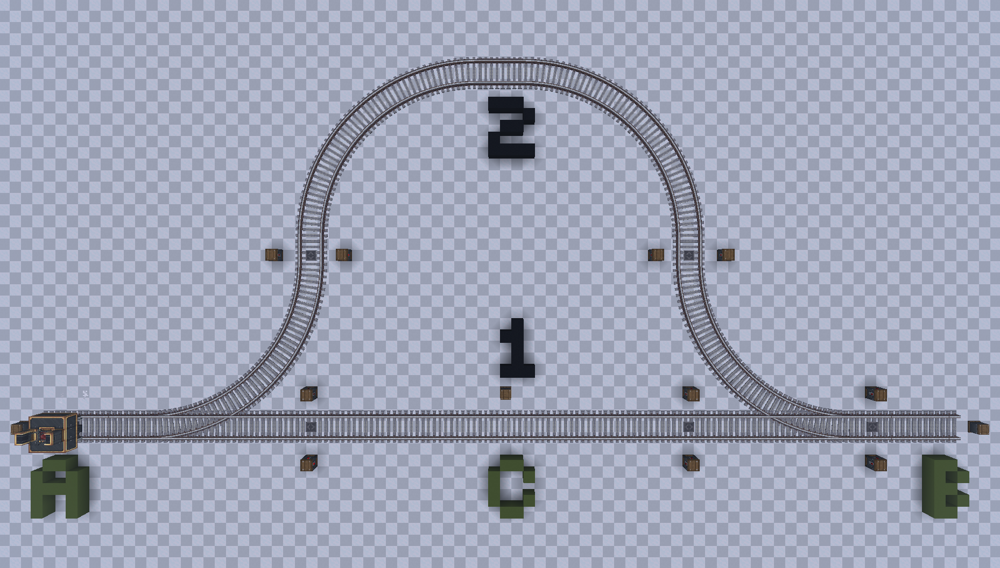
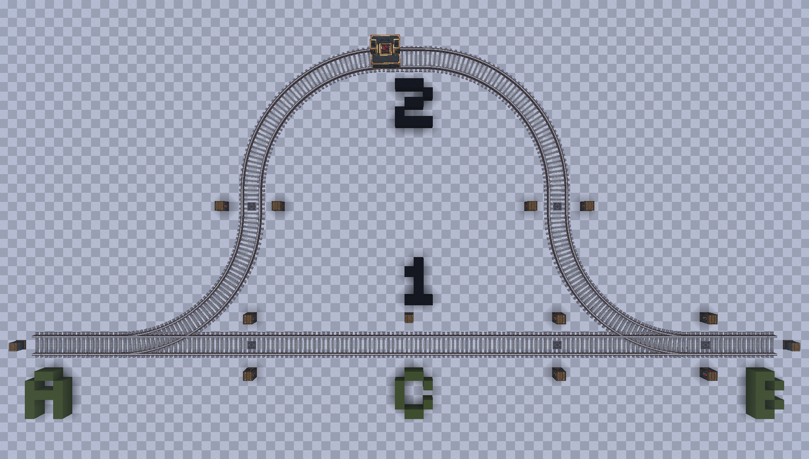
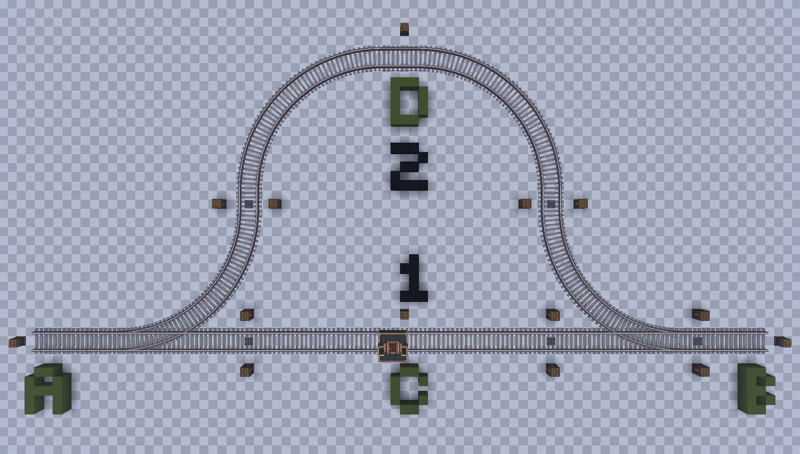

# Train Penalty System Guide

In order for a Train to take the best/fastest route from one location to another, does it calculate each possible Track's "Penalty value" and pick the one with the lowest.  
This Guide will explain how exactly it works, what possible issues this could cause and what you can try and do in order to avoid this.

<!-- more -->

## The Penalty System

When checking a route to a target does the Train check for certain Blocks and trains on it, to calculate a Penalty value for it. This value determins whether this route will be picked over others.

### Example 1

In our example do we have two stations named A and B connected by two routes, which we Label 1 and 2:  

If we were now sending a Train from A to B, what route would it pick?  
The answer is 2. While 1 seems shorter - which it is - does it contain a station (Labeled C), making the route have a penalty value of 50 compared to the other path, which has a penalty value of 0.  
This makes the train want to take route 2, because it avoids going through a Train Station, even if the track is significantly longer. This applies to both directions, no matter which one the station is for:

### Example 2

If we were now adding a Station to Track 2 - Station D - would this result in both Tracks having a penalty value of 50, due to both having 1 Station on them.  
In such a case does the Train pick the route with the shorter distance to its goal, which in our case is Track 1:

## Blocks and Trains with Penalty Values

In create, only certain Blocks and Trains possess a penalty value. As an example does the [[c:Train Observer]] not contain any Penalty value.  
Below can you find a List of all the known Blocks and Trains with a Penalty value.

### Blocks

| Block                         | Description                                                      | Value |
|-------------------------------|------------------------------------------------------------------|------:|
| Station                       | A Train Station                                                  | 50    |
| Station w/ Train              | A Train Station with a Train occupying it                        | 300   |
| Red Signal                    | A red Signal                                                     | 25    | 
| Red Signal (Redstone powered) | A Signal forced red through Redstone or a ComputerCraft Computer | 400   |

### Trains

| Block          | Description                                            | Value                        |
|----------------|--------------------------------------------------------|-----------------------------:|
| Manual Train   | A Train controlled by a Player                         | 200                          |
| Idle Train     | A Train with a paused or no Schedule                   | 700                          |
| Waiting Train  | A Train waiting at a Signal                            | 50 + [wait time](#wait-time) |
| Arriving Train | A Train arriving at a Train Station or Signal          | 50                           |
| Other Train    | Any other Train not matching any of the previous types | 25                           |

/// note | Wait time
    attrs: {id: wait-time}

The wait time for a Train waiting at a signal is either the number of seconds a Train has waited on the Signal, or 1,000.  
Whichever number is lower will be selected, which means the max value cannot go abover 1,050.
///

## Manipulating Penaly Values

Knowing the values of Blocks and Trains allows us to try an manipulate the penalty value to our advantage.  

### Using Stations

By placing additional stations on a route, you can increase its penalty value by 50 each, forcing the train to take the route with less stations and only pick this one, if the other track has a higher penalty value due to trains waiting on it, red signals, etc.

### Penalty Anchor

/// admonition | Unreleased Content
    type: unreleased

This section covers content that has not yet been released to Create Railways Navigator.  
Any information is subject to change and not final!
///

Create Railways Navigator adds a Block called the [Penalty Anchor](../../createrailwaysnavigator/blocks/penalty-anchor.md).  
This block allows you to easily define a penalty value that should be added for this part of the track, allowing you to force a Train to pick a certain path without having to use multiple dummy-stations.