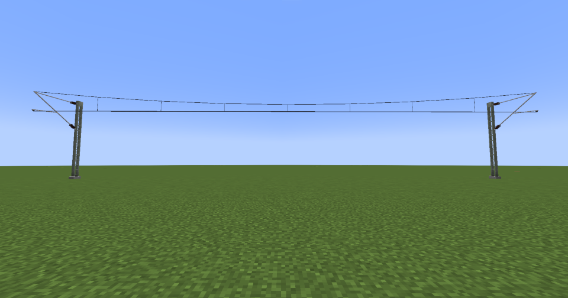
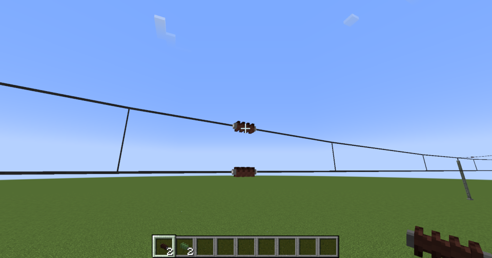

---
categories:
  - Create Pantographs and Wires
---

# Catenary Wire

Catenary wires are used by trains to draw electrical power. These wires are typically placed above the tracks, and the train draws the power from it using a **pantograph**.

## Usage

To place catenary wires, you must select **two connection points**. Valid connection points include:

- **Cantilever** (click on one of the tubes to attach the wire to it)
- **The dropper wires of headspans** (with a registration arm attached)
- **Tensioning device** (used to terminate the wire)

## Decorations
Catenary wires can also be equipped with decorative elements.

- Insulator

