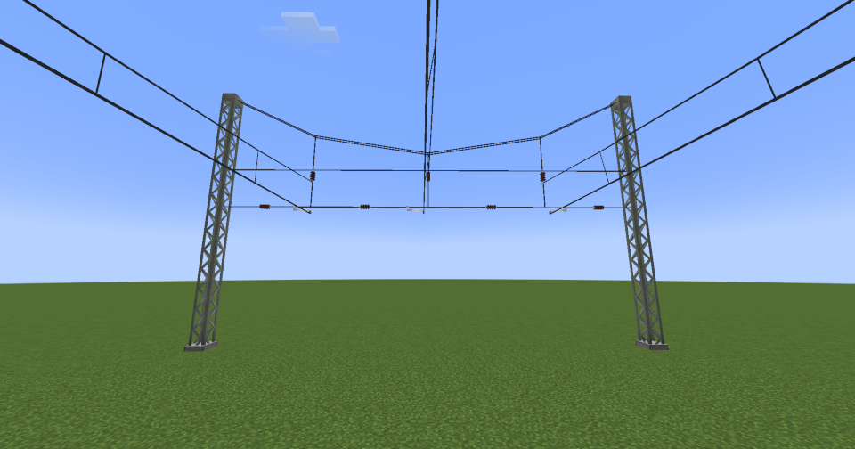
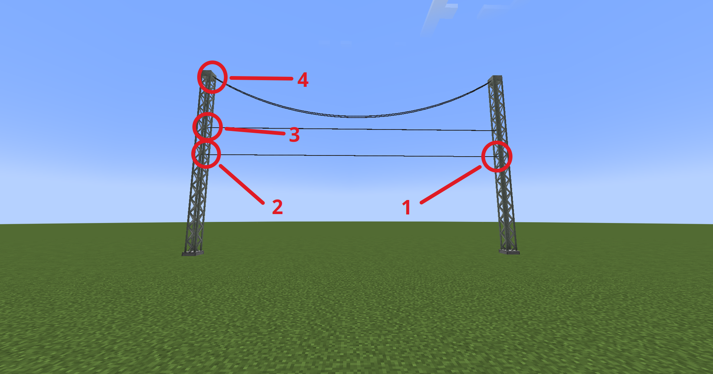
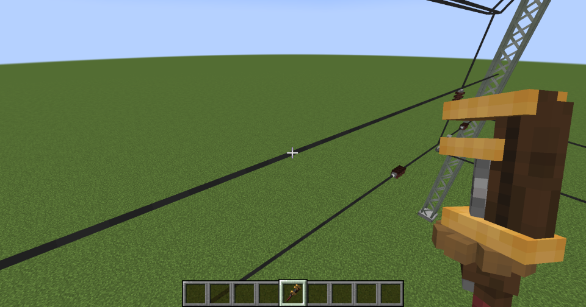
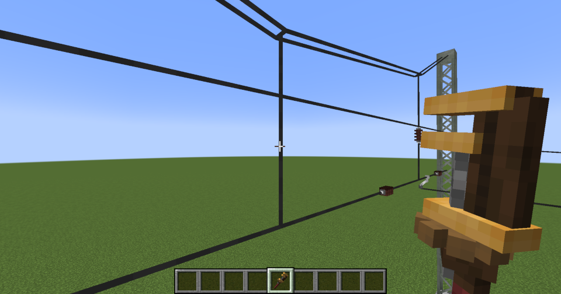
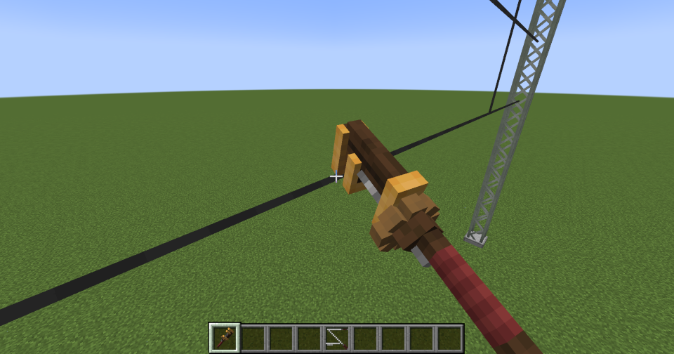
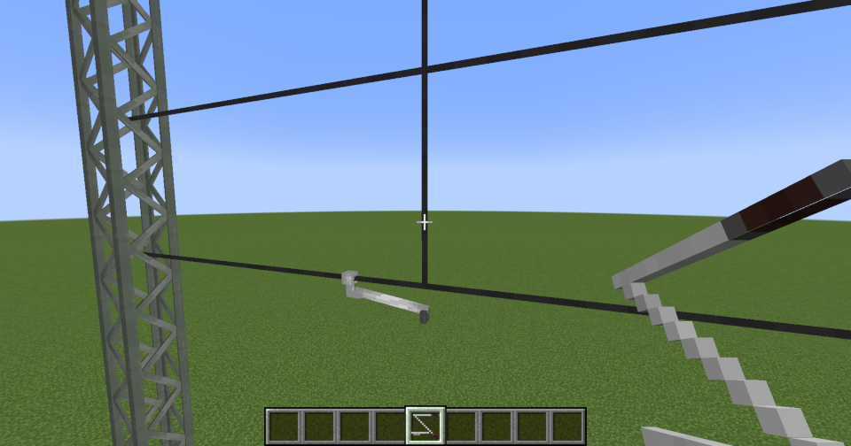
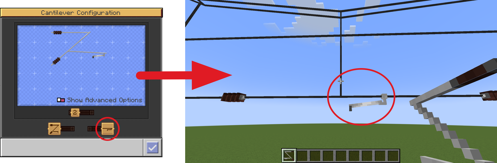
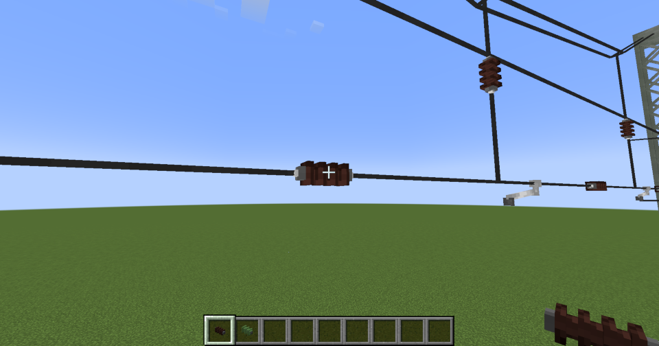

---
categories:
  - Create Pantographs and Wires
---

# Headspans

Headspans are complex wire structures designed to support multiple catenary wires across a larger distance. They serve as an alternative connection point to cantilevers and are primarily used in cases where placing masts with cantilevers is difficult or impossible.

## Usage
### Create a headspan structure

To create a headspan, you need to select **four connection points**:

1. **Point A** of the span (like other wires)
2. **Point B** of the span (like other wires) 
3. **The height of the second support wire** (can also be set on the opposite side)
4. **The height of the upper tension wire** (can also be set on the opposite side)

Valid connection points are:

- **All blocks from the `pantographsandwires:catenary_headspan_connectable` block tag** (e.g. lattice masts)

### Height Differences

Headspan wires consist of **three tension wires**: the two lower wires support the catenary wires, while the upper wire stabilizes the entire structure.

- The **distance between the two lower wires** (the ones carrying the catenary wires) must be **at least 1 block**.
- The **height of the upper tension wire** is calculated based on the distance between the two masts and increases as the span length grows.

### Create and remove dropper wires
To create a dropper wire, right-click on one of the tension wires with a wrench.

To remove a dropper, right-click on the dropper wire with a wrench.

/// warning
All catenary wires and decorations connected to this dropper will be destroyed when removing the dropper.
///

### Connect catenary wires
To connect catenary wires, dropper wires must be created first. You do this by right-clicking on one of the tension wires with a wrench.

Next, a registration arm must be attached to the dropper, to which the catenary wire is connected. This is done by right-clicking on the dropper with a Cantilever item.

Finally, with a Wire Coil and with Catenary Wire type selected, right-click on a dropper with a registration arm to use it as a connection point for the Catenary wire.

/// tip
The type of registration arm specified in the cantilever settings is also used for the registration arm on the dropper. Consequently, the contact wire is positioned as centered, left-shifted, or right-shifted. The direction in which the wire is shifted depends on the relative viewing angle to the headspan wire and can be determined from the preview icon within the cantilever settings.

///

## Decorations
**Insulators** can be placed at different positions on the headspan structure to isolate the individual catenary wires and parts from one another.

