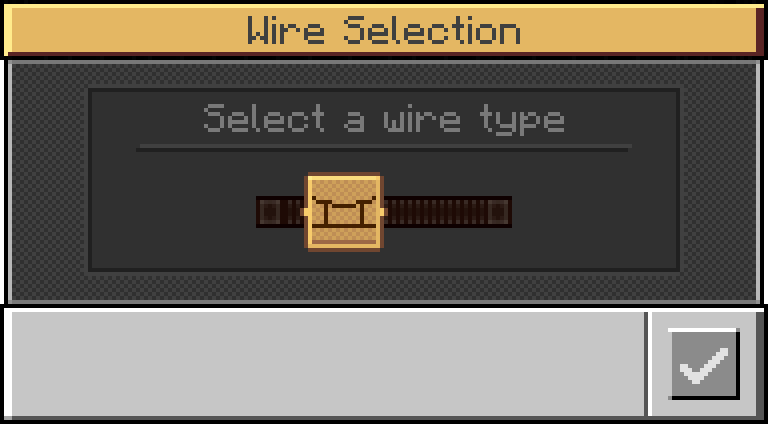

# Wires

The mod adds several different **wire variants**. All of them can be selected and placed using the **Wire Coil** item. Each variant comes with different properties and use cases.

## Place wires

In most cases, you need to select **two connection points** (e.g. a connector block) by right‑clicking them with the item to create a wire between them. But this depends on the wire type and some variants, like the headspan wire, are placed differently.

## Remove wires

All wires can be removed using shears. Doing so will credit the length of the removed wire to an existing Wire Coil item in the player's inventory. Alternatively, if the player only has Empty Wire Coil items, a new Wire Coil item with the corresponding length is created in their inventory.
If the wire cannot be credited to the player, either because they lack the necessary items or inventory space, or because they did not remove the wire directly, then a proportional share of the wire is dropped as Copper Wire items, based on the ratio of the removed length to the standard rate of 400m of wire per 8 Copper Wires. If the calculated item share is less than 1, the probability of a Copper Wire dropping is reduced.