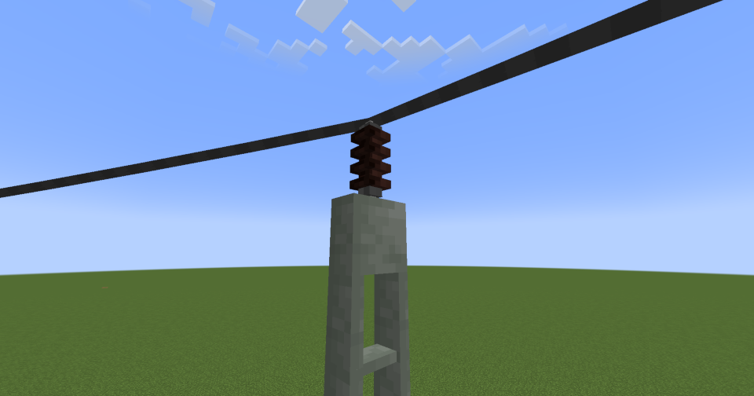
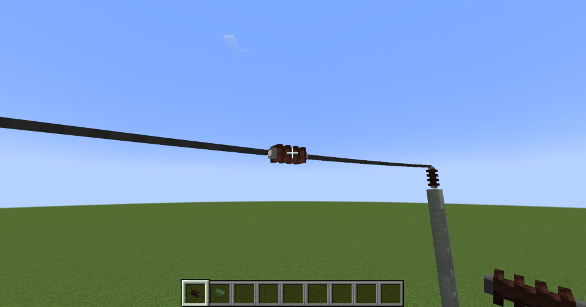

---
categories:
  - Create Pantographs and Wires
---

# Power Wire

In this context, power wires are used to transmit energy, ensuring that the railway infrastructure is continuously supplied with electricity.

/// warning
In the current version, wires do not transmit energy. This variant is purely decorative.
///

## Usage

To place power wires, you must select **two connection points**. Valid connection points include:

- **Placed Insulators** (any type)

## Decorations
Power wires can also be equipped with decorative elements.

- Insulator

