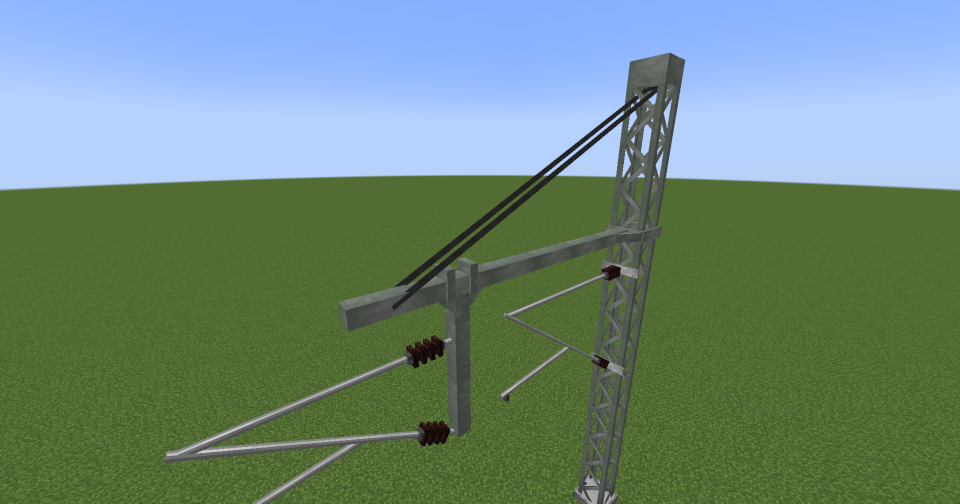

---
categories:
  - Create Pantographs and Wires
---

# Support Wire

Support wires assist heavy transverse axes in bearing their weight.

/// note
This variant is purely decorative.
///

## Usage

To support power wires, you must select **two connection points**. Valid connection points include:

- **All blocks from the `pantographsandwires:support_wire_connectable` block tag** (e.g. lattice masts)

## Decorations
This wire doesn't support any decorations.

