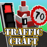
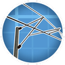

# Welcome to MrJulsen's Mods Wiki

This Wiki hosts information for all of MrJulsen's mods, including crafting recipes, functionalities and various Guides.

/// html | div.grid.cards
- 

    <a href="createrailwaysnavigator">
      
      Create Railways Navigator
    </a>
  

- 

    <a href="dragonlib">
      
      DragonLib
    </a>

- 

    <a href="trafficcraft">
      
      TrafficCraft
    </a>

- 

    <a href="create-pantographs-and-wires">
      
      Create: Pantographs & Wires
    </a>
  

///
